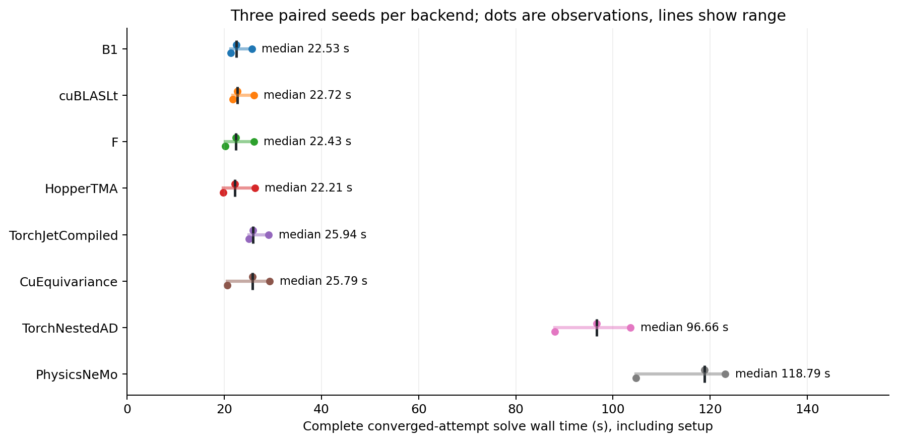
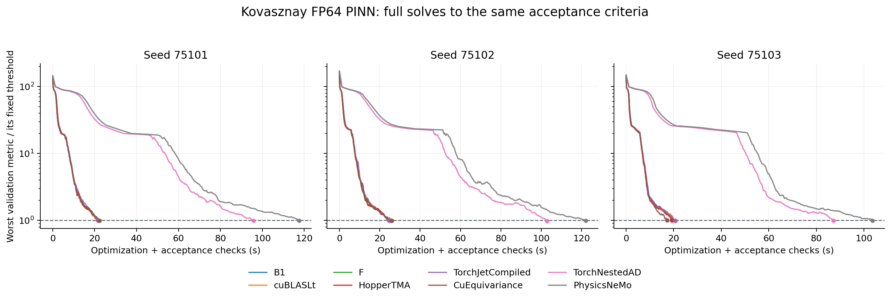

# H100 NVL：同一停止标准下的完整 PINN 求解

本实验求解独立的二维 Kovasznay 稳态 Navier–Stokes 边值问题，比较 B1、cuBLASLt、既有融合 F、Hopper TMA、编译版 Torch jet、cuEquivariance、Torch nested AD 和 PhysicsNeMo 八个后端。实际优化包含边界条件、所有参数更新、线搜索、周期性停止检查及独立最终验收；不以单步梯度时间代替求解时间。

## 固定问题与独立验收

物理坐标域为 x∈[−0.5,1]、y∈[−0.5,1.5]，ν=0.07。解析解为

\[
u=1-e^{\lambda x}\cos(2\pi y),\quad
v=\frac{\lambda}{2\pi}e^{\lambda x}\sin(2\pi y),\quad
p=\frac{1-e^{2\lambda x}}{2},\quad
\lambda=\frac1{2\nu}-\sqrt{\frac1{4\nu^2}+4\pi^2}.
\]

实现用等价的有理化形式计算 λ，避免消去。SymPy 对 ν=7/100 的两条动量方程及连续性方程给出精确零残差。四边固定解析 u,v；x=1 边界的解析 p 固定压力基准。网络为 2–64–64–3，隐藏层 stable tanh，输出线性，共 4,547 个参数，全程 FP64、TF32 关闭。

训练点为 2,048 个固定 Sobol 内点和每边 128 个边界点，共 2,560 点；所有后端使用同一数据种子 642701、同一位置/权重哈希。训练 loss 为

\[
\tfrac12\operatorname{mean}_{\Omega}
\left(r_u^2+r_v^2+d^2+0.2\bigl(|\nabla r_u|^2+|\nabla r_v|^2+|\nabla d|^2\bigr)\right)
+5\left(\operatorname{mean}_{\partial\Omega}|(u,v)-(u_*,v_*)|^2
+\operatorname{mean}_{x=1}(p-p_*)^2\right).
\]

残差梯度需要三阶空间导数。Jet 后端使用同一阶乘归一化规范，nested AD / PhysicsNeMo 直接通过坐标自动微分求出同一 loss。PhysicsNeMo 使用公开 PhysicsInformer 的 NS 动量和连续性残差，残差梯度与边界项在共同外层加入。

停止检查使用另外 8,192 个固定 Sobol 点和每边 257 个边界点。六项指标必须同时满足：

| 指标 | 上限 |
|---|---:|
| sqrt(mean(r_u²+r_v²+d²)) | 0.02 |
| 边界 u,v 分量 RMS | 0.01 |
| x=1 压力 RMS | 0.01 |
| u 相对 L2 | 0.01 |
| v 相对 L2 | 0.02 |
| p 相对 L2 | 0.02 |

候选达到阈值后，还必须在第三组 8,192 个 Sobol 点上通过独立 scalar nested AD 的同一六项验收。所有值必须有限；正式计时后没有放宽任何阈值。

## 更新、预检与预算

每次求解从 CPU 生成的相同初值开始。三个正式种子为 75101、75102、75103，开发 pilot 用 361901，不混入正式统计。每个种子内的八个后端按预先固定的随机顺序串行运行。

先进行 4,000 次 Adam，初始学习率 1e-3，每 1,000 次减半，β=(0.9,0.999)、ε=1e-8；之后使用同一 PyTorch L-BFGS（lr=1、history=50、strong-Wolfe 线搜索、梯度容差 1e-12、变化容差 1e-15）。初始、每 100 次 Adam 和每个至多 20 次 L-BFGS 的 block 后检查。各后端共用同一个独立捕获的 FP64 Adam 更新图。

正式运行前，八个后端都在完整 2,560 点训练问题上通过 loss、全部参数梯度和 3 次实际 Adam 更新检查。参考为独立 nested AD 加 CPU NumPy Adam，阈值 `2e-12 + 2e-11*abs(reference)`。这同时检查了新参数值实际进入 CUDA Graph；没有只比较冻结梯度。

首轮协议先经不同种子的 pilot 验证，再冻结为 [formal1/protocol.json](../experiments/pinn_solver/artifacts/formal1/protocol.json)：Adam 4,000 次，L-BFGS 最多 200 blocks（至多 4,000 次迭代）。24 次运行全部执行完毕，**17 次收敛、7 次达到预算上限仍未收敛**。7 次都来自种子 75102；Torch nested AD 在该种子的首轮预算内收敛，其余七个后端没有达到全部阈值。所有失败均保留在 [首轮 suite](../experiments/pinn_solver/artifacts/formal1/suite.json)。

追加实验对所有后端统一提供最多 500 blocks（至多 10,000 次 L-BFGS）的预算；唯一变化是上限，详见 [extension1/protocol.json](../experiments/pinn_solver/artifacts/extension1/protocol.json)。已经收敛的 17 个运行保留其停止点；另外 7 个从完全相同初始化重新执行完整求解。追加实验有独立报告，不覆盖首轮失败。最终统计分别保留“达到验收的那次完整运行用时”和“包括首轮失败尝试的实际累计进程用时”。

## 计时解释

追加预算后，24 个后端/种子组合均达到同一六项阈值，并通过额外独立 AD 验收。下表取每个后端三次已收敛完整运行的中位数；原始 17 次成功运行复用其测得停止点，另外 7 次使用追加预算下的完整重跑。各列分别取中位数，评估数包括 Adam 与 L-BFGS 的 loss/gradient 调用。

| 后端 | 首轮收敛 | 优化+验收 (s) | 求解总计 (s) | 进程总计 (s) | L-BFGS 次数 | loss/grad 评估数 |
|---|---:|---:|---:|---:|---:|---:|
| B1 | 2/3 | 21.848 | 22.528 | 24.316 | 3,560 | 7,967 |
| cuBLASLt | 2/3 | 21.812 | 22.723 | 24.509 | 3,560 | 7,967 |
| F | 2/3 | 21.867 | 22.427 | 24.219 | 3,560 | 7,974 |
| HopperTMA | 2/3 | 21.647 | 22.206 | 23.991 | 3,560 | 7,974 |
| TorchJetCompiled | 2/3 | 21.472 | 25.941 | 28.358 | 3,340 | 7,731 |
| CuEquivariance | 2/3 | 22.342 | 25.794 | 27.860 | 3,600 | 8,038 |
| TorchNestedAD | 3/3 | 95.766 | 96.660 | 98.470 | 3,160 | 7,511 |
| PhysicsNeMo | 2/3 | 117.541 | 118.790 | 120.786 | 3,800 | 8,260 |

所有运行均完成 4,000 次 Adam。Jet 表示在这个问题上显著减少了高阶坐标 AD 的工作；Hopper TMA 相对已有 F 的完整求解增益较小，不能用局部算子的倍率代替这里的实测时间。





原始分量、逐种子用时和累计尝试成本见 [solver-summary.json](../artifacts/hopper_followup/solver-summary.json)。图中每个点是一次已收敛运行，线段为三个观测的范围，不是统计置信区间。

每次运行使用新的参数、优化器状态和 CUDA Graph。预检已填充依赖/编译器磁盘缓存，因此不是完全冷启动测量。记录三个边界：

- 优化与验收 wall：包含 loss/梯度、参数更新、L-BFGS 线搜索、同步、全部停止检查和最终独立 AD 验收。
- 求解总 wall：加上该次运行的数据准备、backend setup 和 Graph capture。
- 进程总 wall：再包含 Python/库导入、源码哈希、符号检查、检查点写入和进程退出；GPU 状态探针在此区间之外。

GPU 上没有并行运行本任务的其他 benchmark、依赖下载或 CPU 编译。每次运行前后记录设备、功率、时钟、温度和 GPU 进程。数据准备和图捕获没有从求解总耗时中剔除。

有限精度的细微差异会使 L-BFGS 轨迹和停止次数不同。三组种子下的用时是这组固定问题的测量；库之间的差异同时受到导数表示、实现成本和收敛轨迹影响，不能全部归因于单个 kernel。这里不声称三个种子足以证明普遍的收敛或性能优势。

本地审计进一步验证了所有检查点的文件哈希、实际 FP64 参数内容哈希、相同初始化和数据。7 次追加重跑中，6 次与原预算内的所有重合误差检查逐值相同；PhysicsNeMo 首次差异出现在第 100 次 Adam，最大指标差约 3.47e-18，随后 L-BFGS 轨迹和评估数分开，重合区间中单项指标的最大差达到 0.0304。其源码、初始化、数据及配置均相同，最终依然通过原来的两组验收。这一观测作为跨进程复现性的限制单独保留，没有宣称 PhysicsNeMo 的整个求解过程能逐值重放。

完整 [审计 JSON](../artifacts/hopper_followup/audit.json) 中，来源/检查点/验收通过与逐值重放状态为独立字段。56 份报告的源码及本机实验二进制引用均可解析到本地文件或保存的执行版本，没有缺失来源引用。

## 复现与证据

实现：[问题与独立验收](../experiments/pinn_solver/problem.py)、[八后端与共同 Adam](../experiments/pinn_solver/backends.py)、[求解器](../experiments/pinn_solver/solve.py)、[固定预算编排](../experiments/pinn_solver/run_suite.py)、[统一追加预算编排](../experiments/pinn_solver/extend_suite.py)。数值预检见 [preflight-v2.json](../experiments/pinn_solver/artifacts/preflight-v2.json)；每次运行保存完整检查曲线、所有六项指标、额外 AD 验收、参数文件 `.pt` 和来源版本。

先按 [H100 说明](../experiments/cuda_jet_h100/README.md) 准备本机基线、锁定科学库依赖，并完成 [Hopper 构建与验证](cuda-hopper-results.md)，然后运行：

```bash
python experiments/pinn_solver/preflight.py --output experiments/pinn_solver/artifacts/new-preflight.json --hopper-build experiments/cuda_jet_hopper/artifacts/grid1
python experiments/pinn_solver/solve.py --pilot --backend B1 --seed 361901 --output experiments/pinn_solver/artifacts/new-pilot.json --hopper-build experiments/cuda_jet_hopper/artifacts/grid1
python experiments/pinn_solver/run_suite.py --output-dir experiments/pinn_solver/artifacts/new-formal --preflight experiments/pinn_solver/artifacts/new-preflight.json --pilot experiments/pinn_solver/artifacts/new-pilot.json --hopper-build experiments/cuda_jet_hopper/artifacts/grid1
```

脚本拒绝覆盖输出，并在正式执行前核对预检源码哈希与 pilot 协议。环境设置 `OMP_NUM_THREADS=1 MKL_NUM_THREADS=1 OPENBLAS_NUM_THREADS=1`，`PYTHONPATH` 包含 `src` 和锁定科学库的安装目录。这里的 source_id 为 `pinn_kovasznay_solver`，与 OpenAI 官方构造及官方 Euler 冻结样条分别登记。
